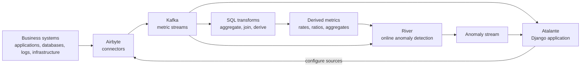

# Atalante

> **Archived project.** Atalante was a work in progress when I moved on to another project. Parts of the architecture are implemented and others are experimental or incomplete. I have not recently verified the full Airbyte, Kafka, Django, and River stack with current dependency versions.

**Real-time anomaly detection across metrics and systems.**

Atalante was an extension of [Eunomia](https://github.com/sandeepbele/eunomia-anomaly-api), exploring a broader problem: useful business signals rarely come from a single metric or a single system.

Request volume may live in an application database, failures in logs, transactions in another service, and infrastructure measurements somewhere else. Looking at each series independently can miss the relationship between them.

For example, `errors = 100` tells you relatively little without knowing whether there were 1,000 requests or 1,000,000.

Atalante explored a pipeline that could bring metrics from different systems together, transform and combine them as streams, and detect anomalies immediately as new data arrived.

## The idea

The intended flow was:

1. Use **Airbyte connectors** to pull data from different source systems.
2. Represent selected time-series metrics as streams in **Kafka**.
3. Aggregate and combine streams using **SQL transformations**.
4. Create derived metrics such as ratios, rates, or other relationships between source metrics.
5. Feed raw or derived metrics into an **online machine-learning model**.
6. Score each observation as it arrives and immediately flag anomalous values.
7. Update the model continuously with each new observation.

For example, two incoming streams:

```text
requests
errors
```

could first be aggregated into one-minute windows and then combined into:

```text
error_rate = errors / requests
```

`error_rate` becomes another time series and can pass through the same anomaly-detection pipeline as any directly observed metric.

The larger idea was to combine **data integration, stream processing, analytics, and online machine learning** in one system.

## Architecture



This diagram represents the intended architecture. Because the project was still under development, not every path shown above was completed as a continuously running production pipeline.

## Derived metrics

An important part of the experiment was treating transformations of existing metrics as first-class time series.

Suppose request and error observations arrive independently:

```text
00:00:01  requests = 100
00:00:03  errors   = 5

00:00:30  requests = 100
00:00:40  errors   = 5
```

They can first be aggregated into a one-minute window:

```text
requests = 200
errors   = 10
```

and then used to create:

```text
error_rate = 10 / 200 = 0.05
```

The resulting `error_rate` can then be analyzed just like a metric received directly from a source system.

The transformation experiments in `app/flows/stream.py` use an in-memory SQLite database and SQL views to join, bucket, and derive metrics from observations.

SQLite provided a lightweight way to experiment with SQL-based transformations over stream data without introducing another stream-processing system.

The committed implementation evaluates supplied observations when the transformation runs. The larger idea of maintaining continuously updated SQL-derived metrics over Kafka streams was not fully completed.

## Real-time anomaly detection

Atalante uses [River](https://riverml.xyz/) for online anomaly detection.

River was a good fit because its models can process observations one at a time. There is no separate batch-training step before anomaly detection begins.

For every observation arriving from Kafka, the system can:

```text
observation arrives
       ↓
   score_one()
       ↓
flag anomaly if needed
       ↓
   learn_one()
       ↓
wait for next observation
```

This means a metric can be evaluated as soon as it appears in the stream rather than waiting for a separate training or batch-processing cycle.

`app/taskmaster.py` consumes Kafka messages and maintains a River detector for each metric.

For each observation, it:

1. calculates an anomaly score using `score_one`
2. compares the score against the configured threshold
3. updates the model using `learn_one`
4. publishes anomalous observations to another Kafka topic

The model therefore learns continuously as new data arrives.

This was one of the main differences from **Eunomia**, where anomaly detection was based on forecasting models trained separately on historical time-series data.

## Airbyte and Kafka

Airbyte provided the integration layer.

Instead of building custom ingestion code for every database, application, or external system, Atalante could use existing Airbyte connectors and map relevant fields from those sources into time-series metrics.

Kafka provided the common streaming layer between ingestion, transformations, and anomaly detection.

Once a metric entered Kafka, the rest of the pipeline could process it independently of the system where the data originally came from.

## Repository structure

The main application is under `app/`. It contains:

- Django views, models, forms, and templates
- Airbyte integration
- Kafka consumers
- stream-processing experiments
- SQL-based metric transformations
- River anomaly-detection code

`webapp/` contains the Django project configuration.

Some of the more relevant code is:

```text
app/
├── flows/
│   └── stream.py        # stream aggregation and SQL transformations
├── taskmaster.py        # Kafka consumption and online anomaly detection
├── models.py
├── views.py
└── ...
```

## Running the transformation tests

The focused SQLite transformation tests only require Python's standard library:

```bash
cd app/flows
PYTHONDONTWRITEBYTECODE=1 python3 -m unittest tests
```

They cover experiments around joining streams, time bucketing, and creating derived metrics such as ratios.

## Project status

Atalante is an archived experimental project.

The repository captures the direction of the system and several working pieces, but development stopped before the entire architecture was connected into a finished service. Some ingestion and derived-metric flows should therefore be considered prototypes rather than production implementations.

The full dependency stack has not been revalidated on a modern environment.
