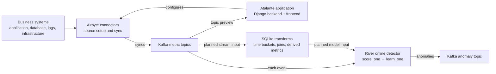

# Atalante

**Cross-system metrics and online anomaly detection**

Business metrics rarely live in one place. Request counts may come from an application, failures from logs, transactions from a database, and infrastructure readings from another system. Looking at each series alone can miss the relationship between them. Atalante explored how to bring those streams together, create useful metrics from them, and analyze the result as new data arrives.

The idea combined data engineering, analytics, and machine learning in one application:

1. Use Airbyte connectors to bring metrics from different systems into Kafka topics.
2. Align and combine observations with SQL. For example, roll second-by-second requests and errors into one-minute totals, then calculate `error_rate = errors / requests`.
3. Feed source or derived metrics into an anomaly detector that scores each new observation and updates its model immediately.

The `web_dashboard/` directory has a misleading historical name: it is the main Django **application**, containing backend views and models, frontend templates and forms, Airbyte integration, Kafka consumers, stream transformations, and ML code. `webapp/` contains the Django project configuration.

## Architecture



Solid arrows correspond to paths represented in the application code. Dotted arrows show the intended composition: the SQLite transformation code exists, but the repository does not wire a continuously updated SQL view between Kafka and River.

## Derived metrics

`web_dashboard/flows/stream.py` loads observations from named streams into an in-memory SQLite database and runs a supplied SQL `CREATE VIEW` query. The original examples join streams and pivot metrics into minute buckets. A focused test added for this archive shows that the same mechanism can also calculate a ratio from two streams:

```text
00:00:01  requests = 100    00:00:03  errors = 5
00:00:30  requests = 100    00:00:40  errors = 5

00:00 minute → error_rate = (5 + 5) / (100 + 100) = 0.05
```

This is the kind of synthetic metric I wanted to send through the same anomaly pipeline as a raw metric. The SQLite code evaluates a supplied set of events each time it runs; it is not a persistent materialized view or a running Kafka-to-SQL processor.

## Online anomaly detection

`web_dashboard/taskmaster.py` consumes Kafka messages and keeps a River detector for each metric. For every observation, the detector calls `score_one`, compares the score with a threshold, and then calls `learn_one` so the model incorporates that observation. Anomalies are published to another Kafka topic. This path has **no separate batch-training step**. River's one-observation-at-a-time API is why I used it here, in contrast with the forecasting-and-training workflow in [Eunomia](https://github.com/sandeepbele/eunomia-anomaly-api).

The source-configuration UI, Kafka consumer, SQL transformation experiments, and online detector are all in the repository. The Airbyte connection setup currently specifies a daily sync, and the continuous derived-metric path in the diagram was not finished. Atalante also does not expose a completed anomaly-detection HTTP endpoint despite the repository name.

## Inspect the focused examples

The SQLite tests use only the Python standard library and cover joining, minute buckets, and a derived ratio:

```bash
cd web_dashboard/flows
PYTHONDONTWRITEBYTECODE=1 python3 -m unittest tests
```

## Note

This project is archived. It preserves a 2023 exploration, not a maintained service. The full Airbyte, Kafka, Django, and River stack has not been revalidated for this archive. The public history retains the original commit dates; three committed scratchpads and a Django development key were removed from the public copy. See [HISTORY.md](HISTORY.md).
